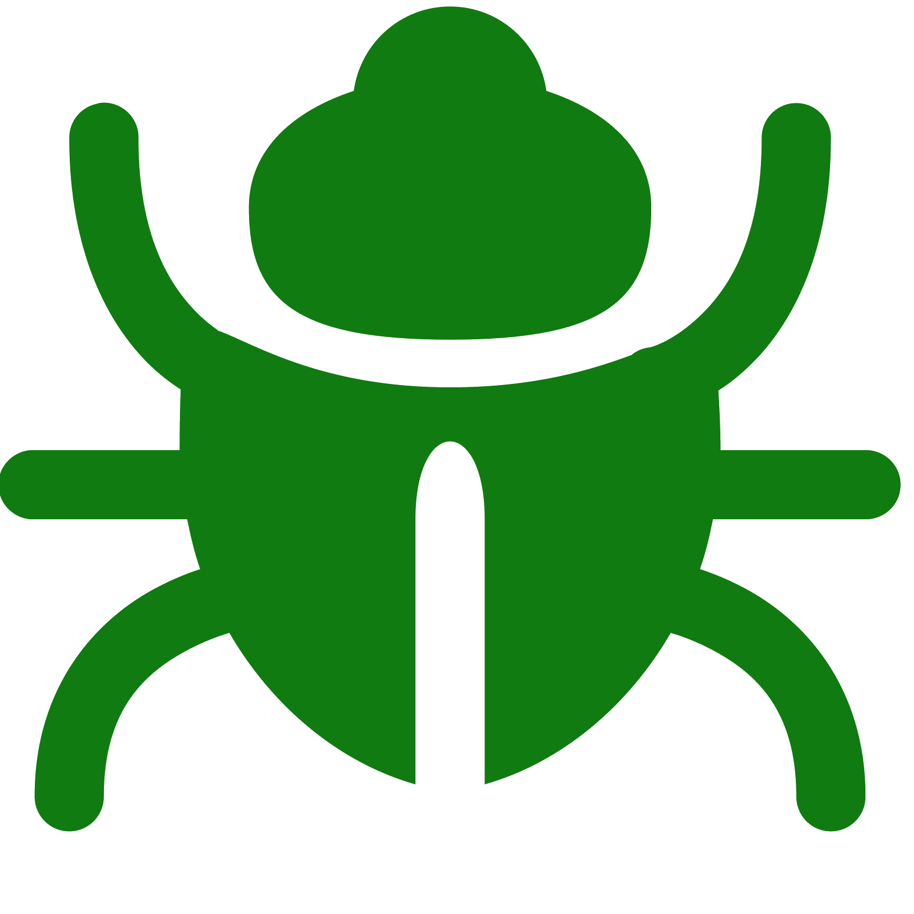

# Bugnosis

**Diagnose bugs. Help thousands. Automate giving back.**

Bugnosis is an AI-powered platform that turns open source contribution into a high-impact, gamified experience. It finds the bugs that matter most, helps you fix them with AI, and tracks the real-world impact of your work.



## The Mission

Most developers want to contribute to open source, but finding meaningful work is hard. "Good first issues" are often trivial.

Bugnosis focuses on **High-Impact Opportunities**: bugs that affect thousands of users, block major releases, or cause significant pain. We call this the **Hero Engine**.

[Read our Full Vision](VISION.md)

## Key Features

*   **Smart Search:** Type "Firefox" or "Linux Kernel", and our AI resolves the targets across GitHub, GitLab, and Bugzilla.
*   **Impact Scoring:** Every bug is scored (0-100) based on user base, severity, and time-to-fix.
*   **Hero Profile:** Earn XP, rank up from *Script Kiddie* to *Ecosystem Guardian*, and unlock badges.
*   **AI Co-Pilot:** An intelligent assistant that helps you diagnose issues, draft Pull Requests, and analyze rejections.
*   **Privacy First:** Works offline. Local-first database.

## For Developers & Power Users

We built Bugnosis to be a serious engineering tool.

*   **System Doctor:** `bugnosis doctor` checks your environment (Podman, Git, Python).
*   **Cloud Sync:** `bugnosis sync push` backs up your profile to a private GitHub Gist (Config-as-Code).
*   **Secure Auth:** `bugnosis auth login` stores tokens in your system keyring.
*   **Rejection Coaching:** `bugnosis coach` performs AI post-mortems on closed PRs to help you learn.
*   **Plugin System:** Extend the core with custom Python modules in `~/.bugnosis/plugins`.

[Read the Developer Guide](DEVELOPERS.md)

## Getting Started

### 1. Installation

*Currently in early development. Build from source:*

```bash
# Clone the repo
git clone https://github.com/thebyrdman-git/bugnosis.git
cd bugnosis

# Install CLI dependencies
cd cli
pip install -e .

# Run the GUI
cd ../gui
npm install
npm run tauri dev
```

### 2. Your First Scan

Use the CLI or the Desktop App to find your first target:

```bash
bugnosis smart-scan "python requests library"
```

## Roadmap

We are building the "Antivirus for Open Source Bugs".

*   **Phase 1:** Impact Engine & Smart Search (Current)
*   **Phase 2:** AI Co-Pilot & Rejection Coaching (Current)
*   **Phase 3:** Cloud Sync & Community Leaderboards (In Progress)

[View the full Roadmap](ROADMAP.md)

## Contributing

We welcome feedback on our vision and architecture!

Please check out [CONTRIBUTING.md](CONTRIBUTING.md) for guidelines on how to get involved.

## License

MIT License. Free and open source forever.
